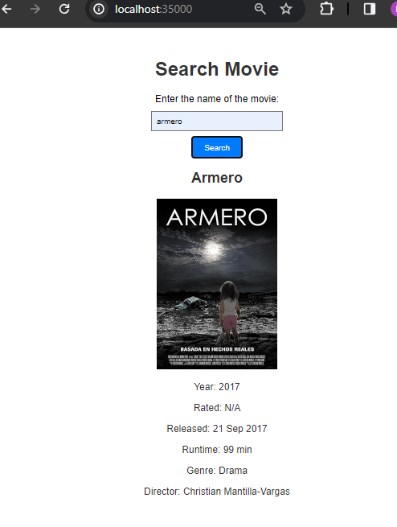

# Taller 1: Aplicaciones distribuidas (HTTP, SPETS, HTML, JS, MAVEN, GIT)

El objetivo del taller es construir una aplicación para consultar la información de películas de cine. La aplicación recibirá una frase de búsqueda del título, por ejemplo “Guardians of the galaxy” y deberá mostrar los datos de la película correspondiente.

Para lo anterior, se utilaza el API gratuito de [OMBd](https://www.omdbapi.com/).

## Iniciando

Estas instrucciones le permitirán obtener una copia del proyecto en funcionamiento en su máquina local para fines de desarrollo y prueba.

### Prerequisitos

Qué cosas se necesitan para ejecutar el software.

* Git
* Maven
* Java

### Instalación	y ejecución

A continuación se presentan los pasos para obtener una copia del proyecto en funcionamiento en su máquina local.

* Clonar el proyecto
    ```bash
    git clone https://github.com/An6ie02/AREP_TALLER_01.git
    cd AREP_TALLER_01/Distributed-Appliations
    ```
* Compilar el proyecto
    ```bash
    mvn clean compile
    ```
* Ejecutar el proyecto
    ```bash
    mvn exec:java -Dexec.mainClass="edu.escuelaing.arep.distributedapp.HttpServer"
    ```
* Diríjase a su navegador de preferencia y vaya a la siguiente dirección: [http://localhost:35000/](http://localhost:35000/) para ver la aplicación en funcionamiento, como se muestra a continuación:\

    Página principal donde podrá buscar la película que desee.\
    \
    Página de resultado de la búsqueda.\
    \
    Caso en el que la película no existe o no se encuentra.\
    

## Ejecutando las pruebas

Para ejecutar las pruebas, corra el siguiente comando:

```bash
mvn test
```
Las pruebas confirman que la aplicación funciona correctamente. Se comprueba que al hacer una búsqueda de una película, se obtiene la información de la misma en formato JSON. Tambien se comprueba que al hacer una búsqueda de una película que no existe, se obtiene un mensaje de error y finalmente, que la información de la película corresponde a la consultada.

## Documentación

Para generar la documentación de la aplicación, debe ejecute el siguiente comando.

```bash
mvn javadoc:javadoc
```
El anterior comando crea un archivo con la documentación de la aplicación, esta la puede encontrar en `./target/site/apidocs/index.html`.

## Construido con

* [Maven](https://maven.apache.org/) - Administrador de dependencias
* [OMDAPI](https://www.omdbapi.com) - API externa de consulta

## Diseño y descripción de la aplicación

La aplicación se compone de dos clases principales, `HttpServer` y `HttpClient`. La primera es la encargada de recibir las peticiones del cliente y la segunda es la encargada de realizar la consulta al API de OMDb. Su aruitetura es de tipo cliente-servidor, donde el cliente es el navegador y el servidor es el programa que se ejecuta en el puerto 35000.

### Extensión de la aplicación

La aplicación puede ser extendida para que se puedan realizar consultas de películas por otros parámetros, como por ejemplo, por año de lanzamiento, por director, por género, entre otros. Para esto, se debe modificar el método `getMovie` de la clase `HttpClient` para que reciba un parámetro adicional que indique el tipo de búsqueda que se quiere realizar. Además, se debe modificar el método `getMovie` de la clase `HttpServer` para que reciba el parámetro adicional y se modifique la respuesta que se le envía al cliente.

También se puede modificar la fuente de datos de la aplicación, es decir, el API de OMDb, por otro API que cumpla con el mismo formato de respuesta.

### Modularización

En la aplicación cada clase definida tiene una responsabilidad específica:

* `HttpServer`: Se encarga manejar los soets, recibir las peticiones del cliente y enviar la respuesta correspondiente.
* `HttpClient`: Se encarga de realizar la consulta al API de OMDb y obtener la información de la película.

## Autor

* **Angie Natalia Mojica** [Angie Natalia Mojica](https://www.linkedin.com/in/angienataliamojica/)

## Acknowledgments

* Al profesor [Luis Daniel Benavides Navarro](https://www.linkedin.com/in/danielbenavides/) por la guía y la enseñanza en el curso de Arquitecturas Empresariales.
